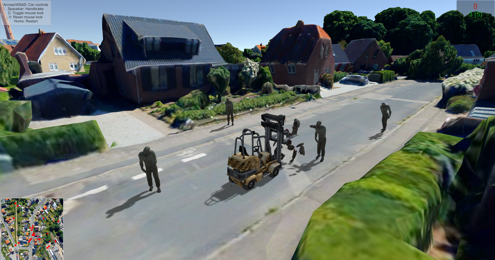
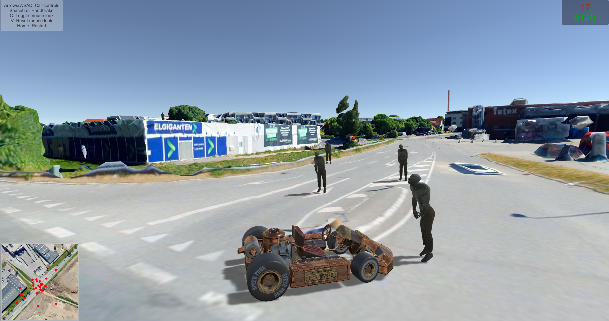
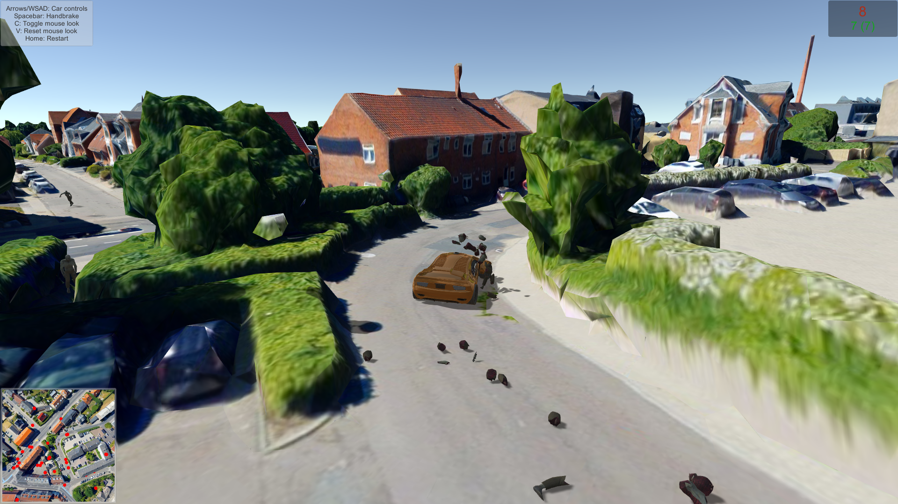

# Vtsmageddon

Vtsmageddon is a zombie apocalypse in Hillerod, city of Denmark, where you drive a car and smash them rotten flesh!

The city data is provided by VTS geospatial software stack integration plugin in Unity 3D.

Disclaimer: No identification with actual persons (living or deceased) is intended or should be inferred. No animals were harmed in the making of this game.

# Building

Either download and install the VTS plugin from Asset Store:
https://assetstore.unity.com/packages/tools/terrain/vts-landscape-streaming-plugin-125885

Or clone and build the VTS plugin from sources:
https://github.com/melowntech/vts-browser-unity-plugin

Please note, this example game is developed together with the plugin and therefore it may depend on some features of the VTS plugin that are not yet published to the store, or vice-versa.
